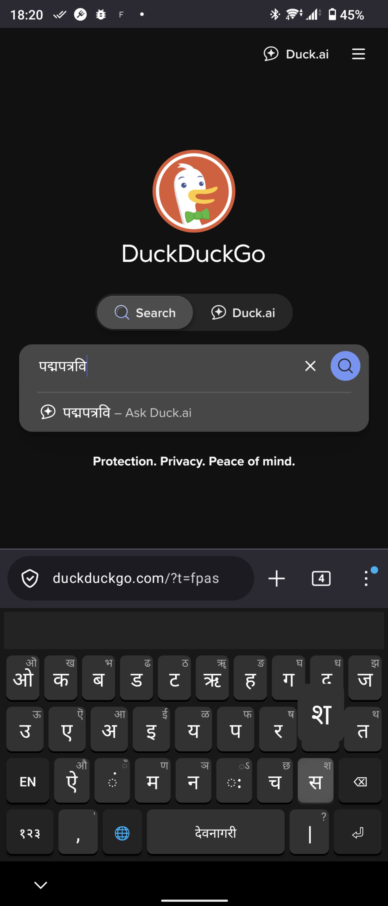
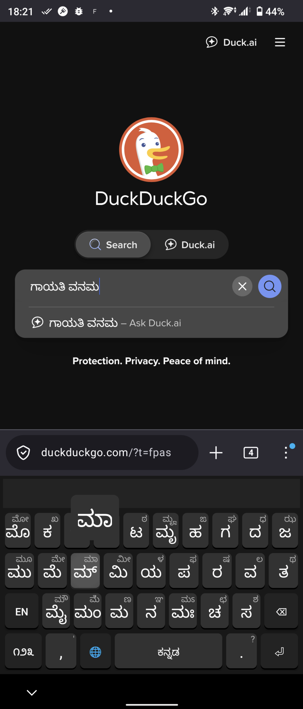

* KrKey Android

KrKey is a highly customizable, extensible, and gesture-capable Input Method Editor (IME) for Android, originally inspired by a Sailfish OS prototype. It focuses on providing a unified, ergonomic typing experience for over 30 Brahmi-derived scripts, alongside a fully-featured Latin layout.

LICENSE: [[https://www.gnu.org/licenses/gpl-3.0.en.html][GPLv3]].

#+ATTR_ORG: :width 512

#+ATTR_ORG: :width 512

** Features

- *Multi-Script Support:* Supports Devanagari, Kannada, Malayalam, Tamil, Telugu, and many more historical/experimental Brahmi scripts (Sharada, Grantha, Siddham, etc.).
- *QMK-Style Architecture:* The keyboard layout is defined using a declarative, layer-based grid system in =KeyMap.kt=. This allows for extremely easy customization of base and flick-up characters without touching UI code.
- *Flick Input:* Heavily relies on Japanese-style flick gestures (up-direction only) to access secondary characters (e.g., long vowels, aspirated consonants, uppercase letters), keeping the keyboard interface clean and uncluttered.
- *Optimized Layouts:* Includes language-specific layout overrides, such as a custom Tamil grid ergonomically designed around corpus consonant/vowel frequencies to maximize bimanual alternation.
- *Multi-Touch Pecking:* Engineered to support fast, two-thumb pecking without dropping keystrokes.
- *Gesture Typing:* Integrated swipe-to-type support for the Latin layout, complete with an intelligent auto-spacing engine that respects punctuation and sentence boundaries.
- *Direct Commit Model:* Uses direct =commitText= operations instead of composing spans, bypassing known cursor jumping and text doubling bugs present in many modern web wrappers and third-party editors (like Perplexity AI).
- *Spacebar Cursor Control:* Slide left or right on the spacebar to precisely move the text cursor.

** Architecture & Customization

The core layout logic resides in =app/src/main/kotlin/com/akssri/krkey/KeyMap.kt=.

Keys are defined as tuples =(Base to Flick)=. For example, in the Latin grid, ="a" to "A"= means a tap produces 'a', and an upward flick produces 'A'.

To change a character on any layer (Indic, Latin, Symbols), simply edit the corresponding =List<List<Any>>= grid in =KeyMap.kt=.

** Building

The project is built using Gradle. To compile the APK:

#+BEGIN_SRC bash
cd krkey-android
./gradlew assembleDebug
#+END_SRC

/(Note: If building on NixOS, you may need to configure =local.properties= to point to your specific Android SDK and build tools.)/

*** Code Formatting

The project uses =ktlint= to enforce code style. Before submitting changes, run the formatter:

#+BEGIN_SRC bash
./gradlew ktlintFormat
#+END_SRC

** Installing

To install the compiled debug APK on a connected device:

#+BEGIN_SRC bash
adb install -r app/build/outputs/apk/debug/app-debug.apk
#+END_SRC

** Enabling the Keyboard

1. Go to *Settings -> System -> Languages & input -> On-screen keyboard -> Manage on-screen keyboards*.
2. Toggle on *KrKey*.
3. Tap on a text field to bring up your current keyboard.
4. Tap the keyboard icon in the bottom navigation bar (or use your device's input switcher) and select KrKey.

** Development Status

This keyboard is under active development. Current focus areas include refining the gesture prediction dictionary, expanding test coverage, and fine-tuning physical touch thresholds.
